# Домашнее задание к занятию «Уязвимости и атаки на информационные системы»  - Клочек Максим

### Задание 1

Скачайте и установите виртуальную машину Metasploitable: https://sourceforge.net/projects/metasploitable/.

Это типовая ОС для экспериментов в области информационной безопасности, с которой следует начать при анализе уязвимостей.

Просканируйте эту виртуальную машину, используя **nmap**.

Попробуйте найти уязвимости, которым подвержена эта виртуальная машина.

Сами уязвимости можно поискать на сайте https://www.exploit-db.com/.

Для этого нужно в поиске ввести название сетевой службы, обнаруженной на атакуемой машине, и выбрать подходящие по версии уязвимости.

Ответьте на следующие вопросы:

- Какие сетевые службы в ней разрешены?
- Какие уязвимости были вами обнаружены? (список со ссылками: достаточно трёх уязвимостей)
  
*Приведите ответ в свободной форме.*  

---
### Решение 1

Результат сканирования 

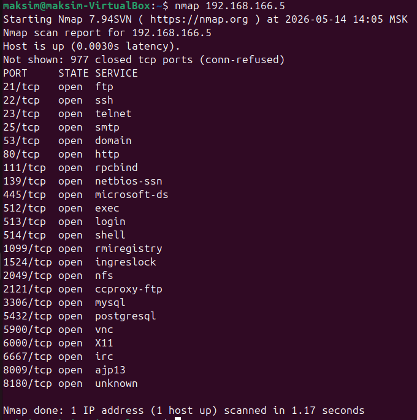

На сканируемой машине работают:
- Сервера FTP, почтовый, HTTP, DNS
- Разрешен доступ по SSH и Telnet
- Работают базы данных MySQL и PostgeSQL

Подробно просканируем отдельные порты и найдём уязвимости:

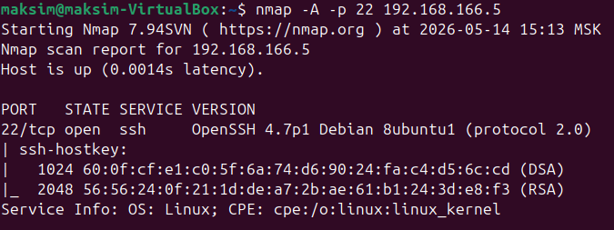
- Уязвимость [OpenSSH 2.3 < 7.7 - Username Enumeration](https://www.exploit-db.com/exploits/45233)

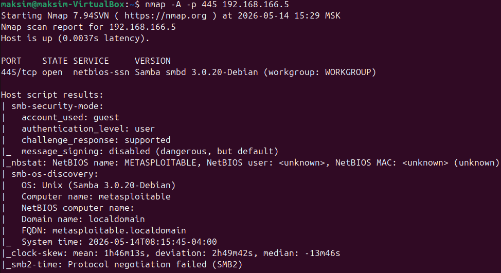
- Уязвимость  [Samba < 3.0.20 - Remote Heap Overflow](https://www.exploit-db.com/exploits/7701)

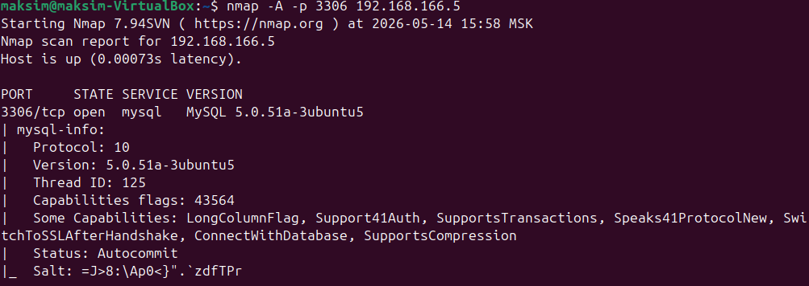
- [MySQL 5.1.48 - 'EXPLAIN' Denial of Service](https://www.exploit-db.com/exploits/34506)
---

### Задание 2

Проведите сканирование Metasploitable в режимах SYN, FIN, Xmas, UDP.

Запишите сеансы сканирования в Wireshark.

Ответьте на следующие вопросы:

- Чем отличаются эти режимы сканирования с точки зрения сетевого трафика?
- Как отвечает сервер?

*Приведите ответ в свободной форме.*

---
### Решение 2

- Режим сканирования SYN `sudo nmap -sS 192.168.166.5`
  - Результат сканирования 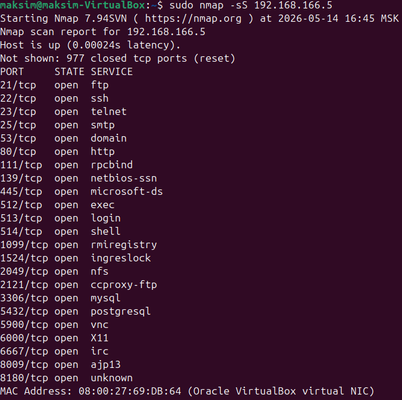
  - Запросы на сканируемый ПК в Wireshark 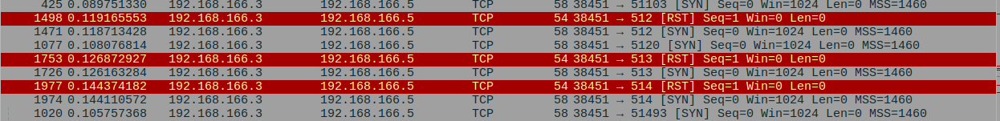 
  - Ответы 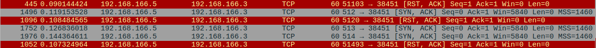
  - nmap в своем результате показывает только те порты которые ответили SYN + ASK, т.е. согласились на установку TCP соединения

- Режим сканирования FIN `sudo nmap -sA 192.168.166.5`
  - Результат сканирования 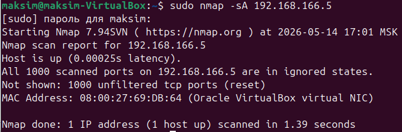
  - Запросы и ответы на сканируемый ПК в Wireshark 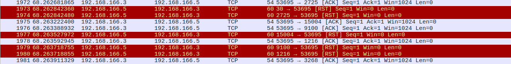 
  - В результате на все запроса ACK пришел ответ RST, это значит что фильтрация пакетов нет, и firewall не настроен

- Режим сканирования Xmas `sudo nmap -sX 192.168.166.5`
  - Результат сканирования 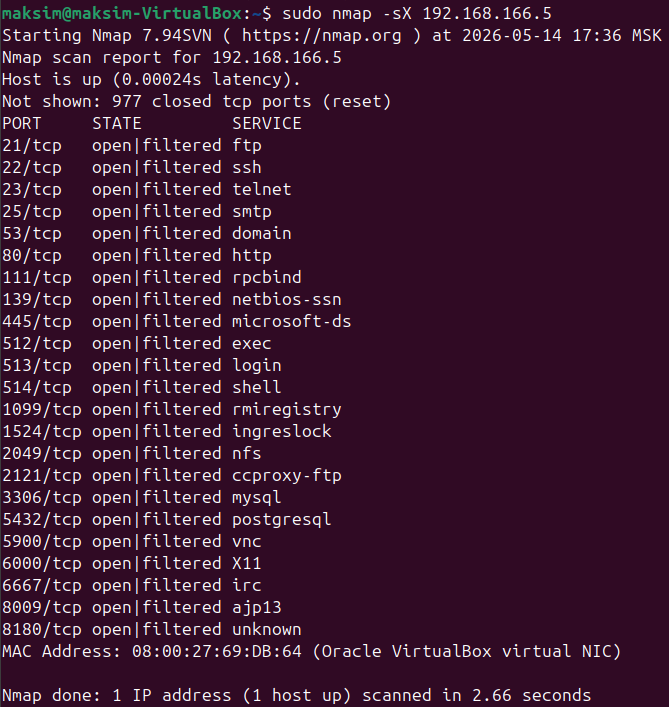
  - Запросы на сканируемый ПК в Wireshark 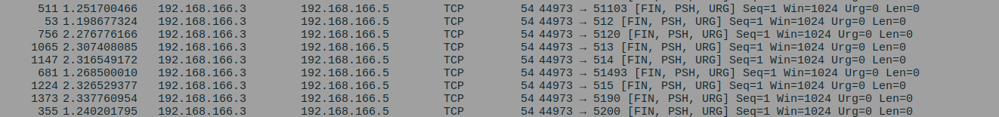 
  - Ответы 
  - nmap отправляет запросы FIN + PSH + URG и в отчёте показывает те которые не ответили RST + ASK, не отвечающие порты могут быть открытыми или ответ по ним блокироваться фаерволом
  
- Режим сканирования UDP `sudo nmap -sU 192.168.166.5`
  - Результат сканирования 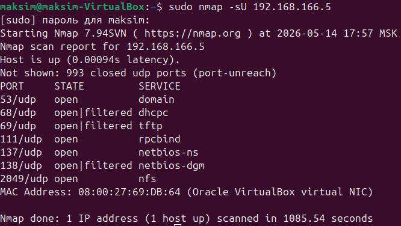
  - Запросы и ответы на сканируемый ПК в Wireshark 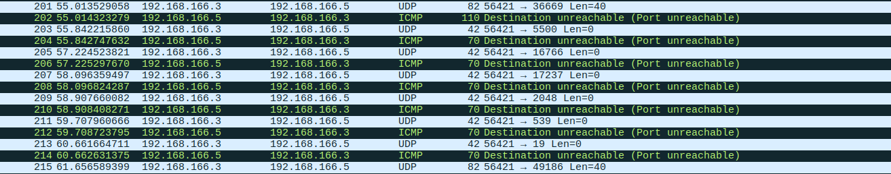 
  - Отправляются UDP пакеты и ожидается результат

---